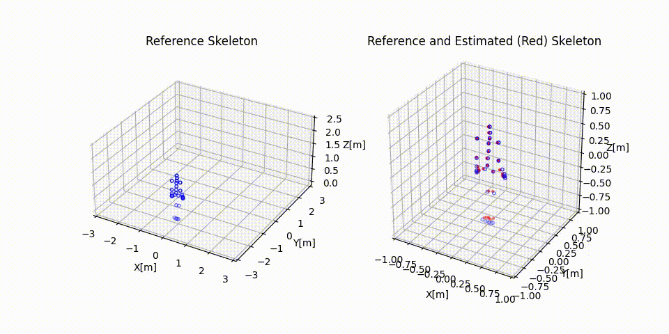
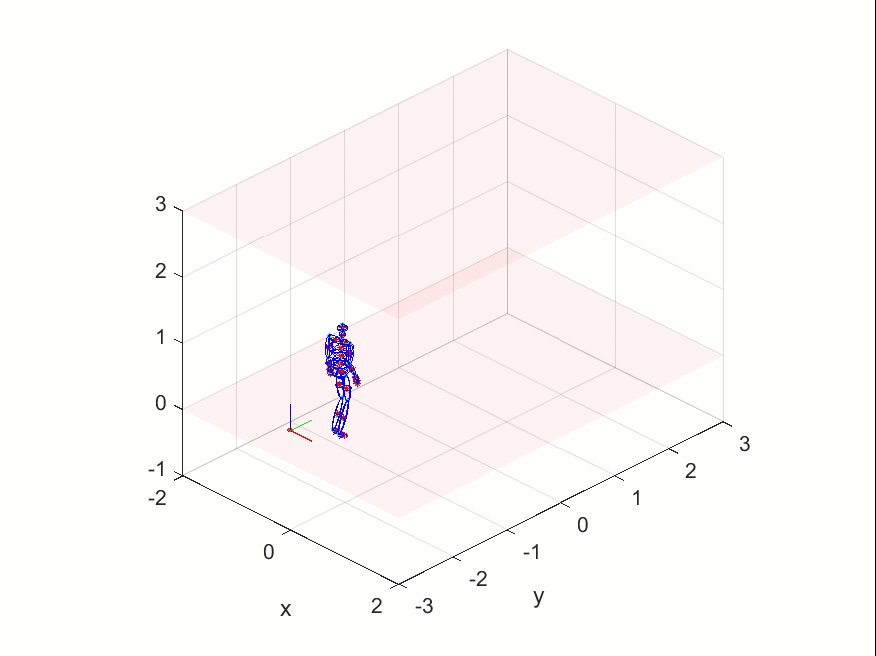
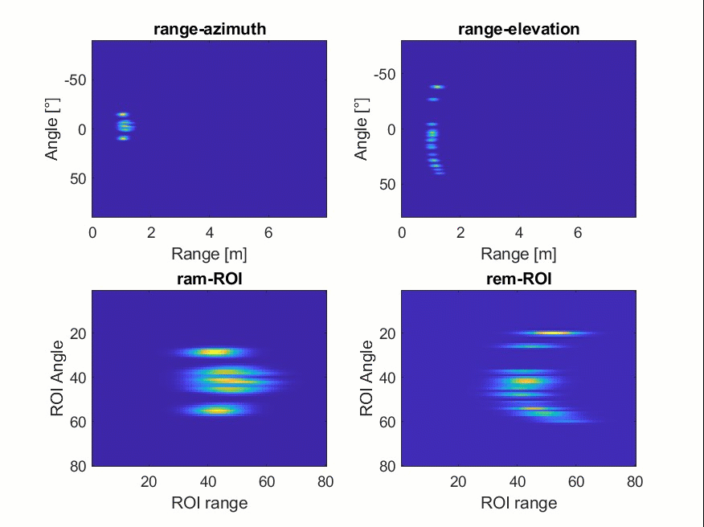

 

<h1 align="center">FMCW RADAR-BASED POSE ESTIMATION WITH A CONVOLUTIONAL NEURAL NETWORK</h1>

<!-- TABLE OF CONTENTS -->

  
Table of Contents

  <ol>
    <li><a href="#about-the-project">About The Project</a></li>
    <li>
      <a href="#synthetic-dataset-generation">Synthetic Dataset Generation</a>
      <ul>
        <li><a href="#skeleton-retrieval-from-mocap-dataset">Skeleton Retrieval from MoCap Dataset</a></li>
        <li><a href="#synthetic-radar-signal-generator">Synthetic Radar-Signal Generator</a></li>
        <li><a href="#radar-processing">Radar Processing Chain</a></li>
      </ul>
    </li>
    <li><a href="#pose-estimation">Pose Estimation</a></li>
    <li><a href="#usage">Usage</a></li>
    <li><a href="#acknowledgments">Acknowledgments</a></li>
  </ol>

<!-- ABOUT THE PROJECT -->
## About The Project

This project was created as the initial part and literature review of my postdoctorate research related to Human Motion Analysis using Radars.
Therefore, in this repository we only implement an already published neural network mPose, that estimates the 3D-joint positions of an skeleton.
Moreover, we intended to create a baseline of different projects/papers available in the literature to have a clear view of the field.
Later we decided to address the synthetic generation of radar signals but that will be explained in a different repository.

This project is divided into 2 mayor steps: Synthetic Dataset Generation, and Pose Estimation. Both are further developed in this file.

## Synthetic Dataset Generation

There is no available radar dataset of human motion that also provides the joint position at all times.
Therefore, in order to implement any ML model for Pose estimation, we had to generate synthetic data first.

We faced two challenges. First, where and how to obtain the joint positions?. Second, how to generate the radar images.

### Skeleton Retrieval from MoCap Dataset

The CMU-MoCap dataset contains a huge number of samples. However its use for matlab is not straight forward. 
Therefore, we developed a matlab library that not only computes retrieves the joint positions but also generates ellipsoids fitted to each body part.
An example of the output of this library is shown here:

### Synthetic Radar-Signal Generator
As a first attempt, we only used the position of the joints to create a synthetic radar signal.
Although that is not realistic, it is good enough for our goal of just reproducing/implement a pose estimation approach.
Notice that the synthetic radar signal is of the same nature as the Intermediate Frequency Signal.

### Radar Processing Chain
With the synthetic IF radar signal, we apply a standard radar processing chain.
Therefore, we compute a range-azimuth and range-elevation maps.

## Pose Estimation
As a first approach we implemented the same Convolutional Neural Network as in [mPose_CongShi_2021](https://www.winlab.rutgers.edu/~yychen/daisylab/papers/mPose.pdf).
The output of the estimation can be seen in the first figure of this file.

<!-- USAGE EXAMPLES -->
## Usage
The first two parts regarding the synthetic generation of radar signals is in matlab. Open each folder and execute the script in the root.

The use of the dataset, as well as the training, is done in a Python notebook.
Please open the project with the folder as root.